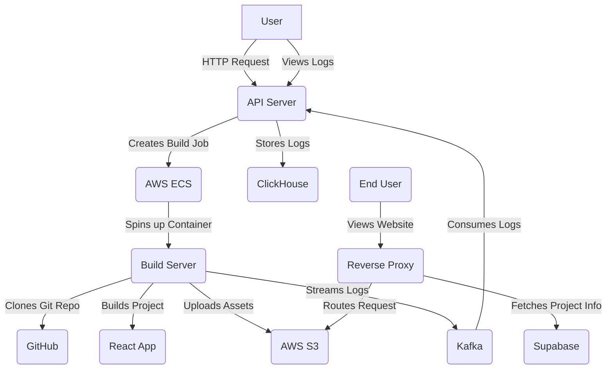

# React Deploy: Deployment Platform for React Applications

React Deploy is a comprehensive, microservices-based platform designed to automate the deployment of React applications. It provides a seamless experience by taking a Git repository URL, building the project in a containerized environment, and deploying the static assets to a cloud-based storage solution. The platform features real-time logging, project management, and a reverse proxy for serving the deployed applications.

## Architecture Overview

The platform is built on a microservices architecture, with three core services working together to provide a robust and scalable deployment pipeline.



### Core Services

*   **API Server:** The central entry point for all user interactions. It handles project creation, triggers new deployments, and provides real-time access to build logs. It is responsible for creating tasks on AWS ECS and consuming log streams from Kafka.
*   **Build Server:** A containerized environment responsible for executing the build process. Each deployment triggers a new AWS ECS task, which runs this service. It clones the specified Git repository, installs dependencies, runs the build script, and uploads the resulting static assets to an AWS S3 bucket.
*   **Reverse Proxy:** A lightweight server that routes incoming traffic to the appropriate deployed application. It dynamically resolves subdomains to their corresponding project assets stored in the S3 bucket, enabling seamless access to the deployed sites.

---

## Features

*   **Automated Deployments:** Simply provide a Git repository URL to build and deploy your React application automatically.
*   **Scalable Architecture:** Built with microservices and containerization to handle multiple concurrent builds efficiently.
*   **Real-Time Logging:** Monitor the build process in real-time with a high-throughput logging system powered by Kafka and ClickHouse.
*   **Centralized Project Management:** Create, manage, and delete deployment projects through a simple and intuitive API.
*   **Custom Subdomains:** Each project is assigned a unique, randomly generated subdomain for easy access.

---

## Getting Started

To run this project locally, you will need to set up each of the three microservices. Please ensure you have the following prerequisites installed on your system.

### Prerequisites

*   **Node.js (v20.x or higher):** [Download Node.js](https://nodejs.org/)
*   **Docker:** [Install Docker](https://docs.docker.com/get-docker/)
*   **Git:** [Install Git](https://git-scm.com/downloads)
*   **AWS Account:** With access to S3 and ECS.
*   **Supabase Account:** For database and user management.
*   **Kafka Cluster:** A running Kafka instance (e.g., Aiven, Confluent Cloud).
*   **ClickHouse Database:** A running ClickHouse instance.

### Setup Instructions

#### 1. Clone the Repository

```bash
git clone https://github.com/your-username/react-deploy.git
cd react-deploy
```

#### 2. Configure Environment Variables

Each of the three services (`api-server`, `build-server`, and `reverse-proxy`) requires its own `.env` file. Create a `.env` file in the root directory of each service and add the following variables:

**`api-server/.env`**

```env
# Supabase Credentials
SUPABASE_URL=YOUR_SUPABASE_URL
SUPABASE_KEY=YOUR_SUPABASE_API_KEY

# AWS Credentials
AWS_REGION=YOUR_AWS_REGION
AWS_ACCESS_KEY_ID=YOUR_AWS_ACCESS_KEY
AWS_SECRET_ACCESS_KEY=YOUR_AWS_SECRET_ACCESS_KEY

# Kafka Configuration
KAFKA_BROKER=YOUR_KAFKA_BROKER_URL
KAFKA_PASSWORD=YOUR_KAFKA_CLUSTER_PASSWORD

# ClickHouse Configuration
CLICKHOUSE_HOST=YOUR_CLICKHOUSE_HOST_URL
CLICKHOUSE_PASSWORD=YOUR_CLICKHOUSE_PASSWORD
```

**`build-server/.env`**

```env
# Supabase Credentials
SUPABASE_URL=YOUR_SUPABASE_URL
SUPABASE_KEY=YOUR_SUPABASE_API_KEY

# AWS Credentials
AWS_REGION=YOUR_AWS_REGION
AWS_ACCESS_KEY_ID=YOUR_AWS_ACCESS_KEY
AWS_SECRET_ACCESS_KEY=YOUR_AWS_SECRET_ACCESS_KEY

# Kafka Configuration
KAFKA_BROKER=YOUR_KAFKA_BROKER_URL
KAFKA_PASSWORD=YOUR_KAFKA_CLUSTER_PASSWORD
```

**`reverse-proxy/.env`**

```env
# Supabase Credentials
SUPABASE_URL=YOUR_SUPABASE_URL
SUPABASE_KEY=YOUR_SUPABASE_API_KEY

# S3 Bucket URL
BUCKET_URL=https://<your-bucket-name>.s3.<your-region>.amazonaws.com
PORT=8000
```

#### 3. Add Kafka Certificate

This project requires a `kafka.pem` file for SSL connections to your Kafka cluster. Place this file in both the `api-server` and `build-server` directories.

#### 4. Build and Run the Services

You can run each service locally or by using Docker.

**Running Locally**

```bash
# API Server
cd api-server
npm install
npm start

# Build Server (Run as a Docker container)
cd build-server
docker build -t build-server .
# This service is triggered by the API server via AWS ECS.

# Reverse Proxy
cd reverse-proxy
npm install
npm start
```

**Running with Docker Compose (Recommended)**

A `docker-compose.yml` file is recommended for a complete, integrated setup.

---

## API Endpoints

The following are the key API endpoints available on the `api-server`:

*   **`POST /login`**: Authenticates a user and creates a record in the database.
*   **`POST /project`**: Creates a new deployment project.
*   **`POST /deploy`**: Triggers a new deployment for an existing project.
*   **`GET /deployments/:id`**: Retrieves all deployments for a specific user.
*   **`GET /logs/:id`**: Fetches the build logs for a specific deployment.
*   **`GET /delete/:projectid`**: Deletes a project and its associated assets from S3.

---

## Technologies Used

*   **Backend:** Node.js, Express.js
*   **Containerization:** Docker
*   **Cloud Services:** AWS (ECS, Fargate, S3)
*   **Database:** Supabase (PostgreSQL), ClickHouse
*   **Messaging:** Kafka
*   **Proxy:** `http-proxy`
